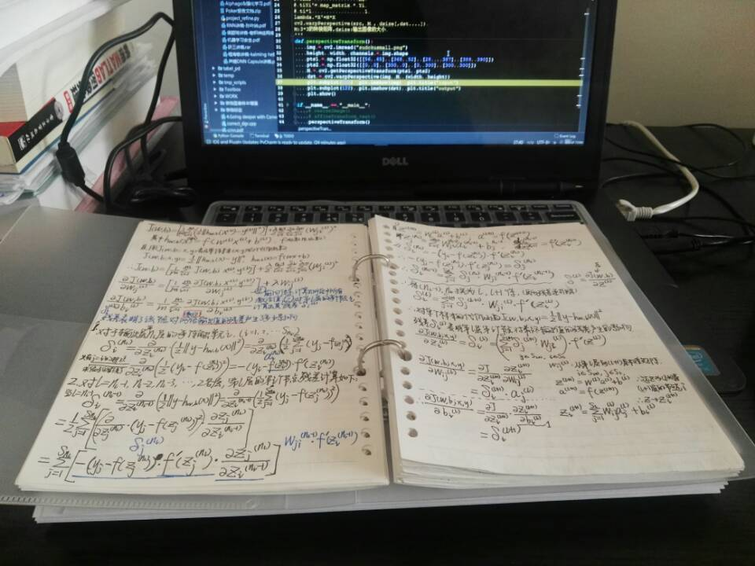
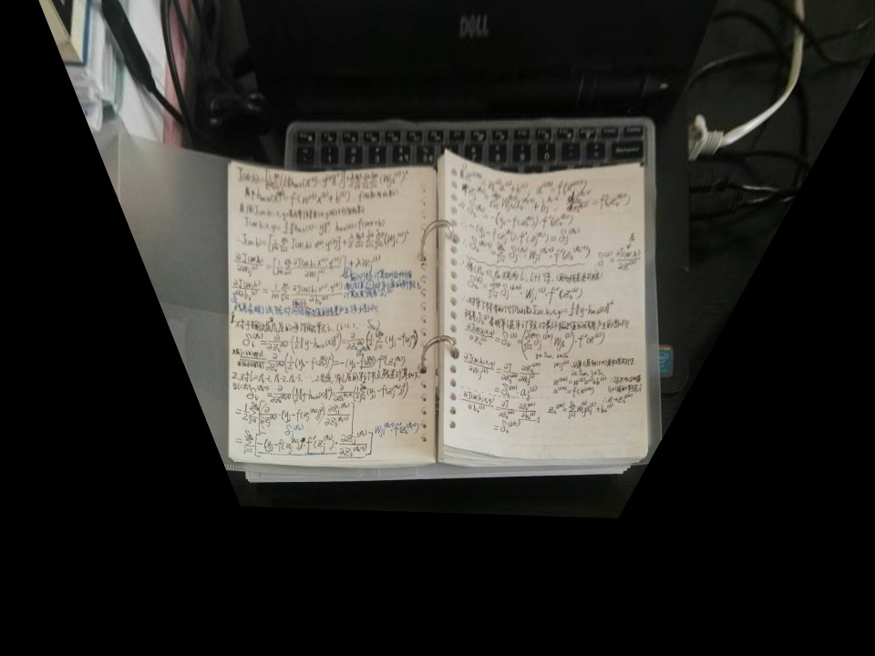
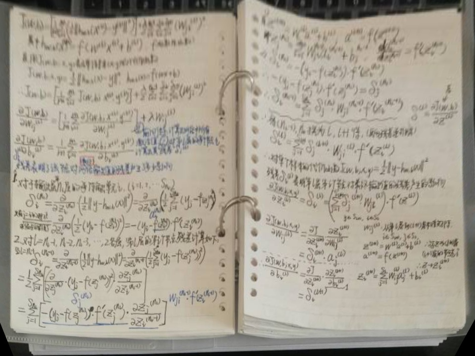
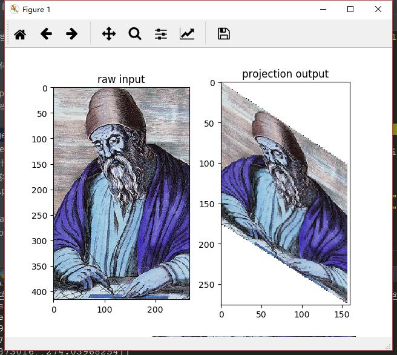
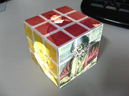

##  ======== 2018 新 年 分 割 线 ========


### 射影变换

由照相机的小孔成像原理，当成像平面与所摄物体所在平面不平行时，产生的就是IP2中的射影变换。
且二维射影平面内的一切射影变换本质都为3x3可逆阵，同时考虑到单应性，变换矩阵的自由度为8,只需4组对应点的x,y坐标值即可求。
求解变换矩阵时可应用矩阵的SVD（奇异值分解）。图像校正的程序如下，需要注意的是：
- Matlab和Python读取图像的原点都在左上角，用鼠标取得的坐标(x,y)中x表示到左边界的距离，y表示到上边界的距离。
- 但读取的图像为矩阵，(i,j)中i表示所在的行数即可理解为到上边界的距离y，j表示所在的列数即到左边界的距离x。


### Python校正图像

校正所需的结果已事先在程序中固定好了，需要的是用鼠标按照左上右上左下右下的顺序标定需要校正的图像中
与校正结果中固定位置的4点相对应的4点。
- 原图

```objc
import cv2
import numpy as np
from matplotlib import pyplot as plt
from pylab import *
from PIL import Image

'''
射影变换：二维射影平面Ip2的任何变换都可用3*3可逆阵表示
原理：在射影形变图像和校正图像中找到对应的4个点，但注意任何3点不能共线
cv2.getPerspectiveTransform(src,dst) 
src:源图像中四边形的4个顶点集合 
dst:目标图像中的4个顶点集合 
lambda.*X'=H*X
cv2.warpPerspective(src, M , dsize[,dst....]) 
M:3*3的转换矩阵,dsize:输出图像的大小 
'''
def perspectiveTransform():
    img = Image.open("./project.jpg")
    im = np.array(img)
    imshow(im)
    print('Please click 4 points,order by lu,lr,dl,dr,(u=up,d=down,l=left,r=right)')
    # 点击的顺序按照左上，右上，左下，右下
    # 获取点击并将点击坐标保存在[x,y]列表中
    x = ginput(4)
    x = np.array(x)
    # 输出保存的数据
    print('you clicked:', x)
    pts1 = np.float32(x)
    plt.close()
    img = cv2.imread("./project.jpg")
    height, width, channels = img.shape
    # 此处坐标(x,y)为x是到左边界的距离，y是到上边界的距离；而读出的图像矩阵x表示所在行数，为到上边界的距离
    # pts1 = np.float32([[56, 65], [368, 52], [28  , 387], [389, 390]])
    pts2 = np.float32([[20, 20], [940, 20], [20, 660], [940, 660]])
    pts3 = np.float32([[250, 180], [710, 180], [250, 500], [710, 500]])
    M = cv2.getPerspectiveTransform(pts1, pts2)
    dst = cv2.warpPerspective(img, M, (width, height))
    M3 = cv2.getPerspectiveTransform(pts1, pts3)
    dst3 = cv2.warpPerspective(img, M3, (width, height))
    # imshow(dst)
    print("completed,show result now!")
    plt.subplot(131), plt.imshow(img), plt.title("raw input")
    plt.subplot(132), plt.imshow(dst3), plt.title("projection regulate")
    plt.subplot(133), plt.imshow(dst), plt.title("enlarge output")
    plt.show()
    cv2.imwrite('./refine_result.jpg', dst3)
    cv2.imwrite('./refine_enlarge.jpg', dst)

if __name__ == "__main__":
    perspectiveTransform()
```
- 结果
 


### Matlab模拟贴图

贴图的原图是整张图，直接按左上右上左下右下取原图的4角坐标即可。
运行时，在要贴的图上按对应顺序标定相应的4点。
- 相对简单的自由度为6的仿射变换当然可以用射影变换求解
但在此处，手动选择坐标不一定还保持平行性，所以实际仍为射影变换。


模拟贴图，将3张数学家的正面画像贴到魔方上
```
warning off%不显示警告
close all;clc;clear;
img_path='./';%原图路径
to_path='./';%贴图路径
new_img='./results/';%新图路径
img_list=dir([img_path,'*.jpg']);
to_list=dir([img_path,'*.png']);
if ~exist(new_img)
    mkdir(new_img);%本程序直接加在原图上了，没有用到new_img文件夹
end
num_img=length(img_list);
%% 显示原图及bbox坐标
for i=1:3
    tmp_i=i;
    img=imread([img_path,img_list(i).name]);
    to_img=imread('cubic.jpg');
    disp(['====',to_list(i).name,'====']);
    figure;imshow(to_img);
    disp('请以左上右上左下右下标定4个点');
    height=size(img,1);
    width=size(img,2);
    x=[1;width;1;width];
    y=[1;1;height;height];
    [xn,yn]=ginput(4);
   for tt=1:4
       xn(tt)=ceil(xn(tt));
       yn(tt)=ceil(yn(tt));
   end
    bound_u=min(yn);
    bound_d=max(yn);
    bound_l=min(xn);
    bound_r=max(xn);
    A=[x(1),y(1),1,0,0,0,-x(1)*xn(1),-xn(1)*y(1),-xn(1);
         0,0,0,x(1),y(1),1,-x(1)*yn(1),-y(1)*yn(1),-yn(1);
         x(2),y(2),1,0,0,0,-x(2)*xn(2),-xn(2)*y(2),-xn(2);
         0,0,0,x(2),y(2),1,-x(2)*yn(2),-y(2)*yn(2),-yn(2);
         x(3),y(3),1,0,0,0,-x(3)*xn(3),-xn(3)*y(3),-xn(3);
         0,0,0,x(3),y(3),1,-x(3)*yn(3),-y(3)*yn(3),-yn(3);
         x(4),y(4),1,0,0,0,-x(4)*xn(4),-xn(4)*y(4),-xn(4);
         0,0,0,x(4),y(4),1,-x(4)*yn(4),-y(4)*yn(4),-yn(4);];
    [~,~,V]=svd(A);
    h = V(:,9) ./ V(9,9);
    H= reshape(h,3,3);
    H=projective2d(H);
    new_im=imwarp(img,H);
    figure;imshow(new_im);
    to_img(bound_u:bound_d,bound_l:bound_r,:)=to_img(bound_u:bound_d,bound_l:bound_r,:)+new_im;
    figure;imshow(to_img);
    imwrite(to_img,'cubic.jpg');
    close all;
end
```
- 结果图 PS:像素有点渣╮(╯_╰)╭


